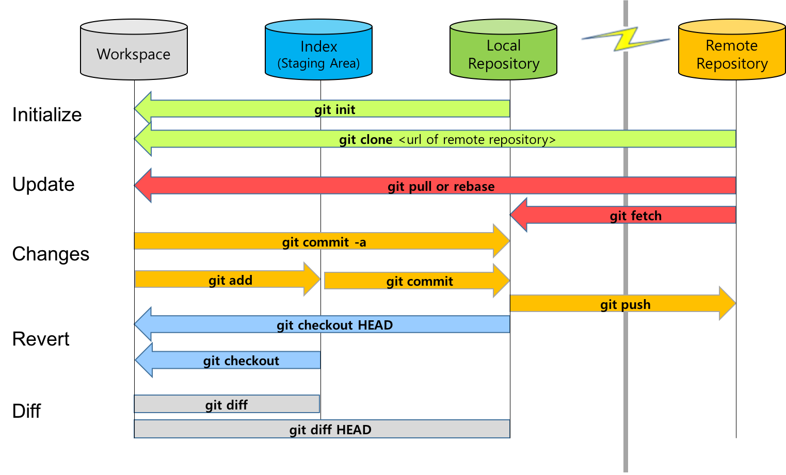
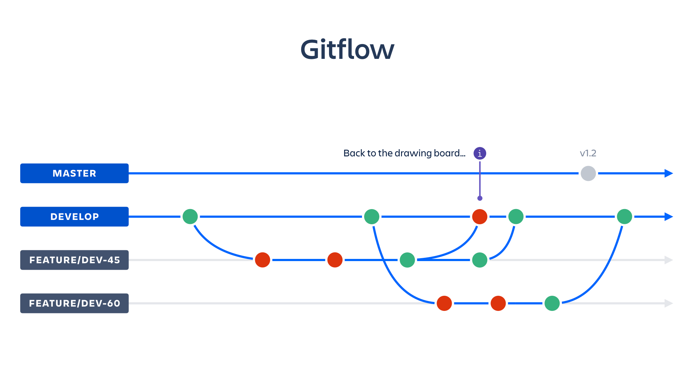

# **Docuementando comandos de GIT con Markdown**


## Esto es lo que vamos haciendo en la práctica de GIT
<br>

### Ejecutar el comando 
```
git init
```

Esto crea el directorio y los archivos de gestión de GIT.
<br><br>
### Ejecutar el comando 
```
git status
```

Este muestra el estado de los recursos con los que estoy trabajando.
<br><br>
### Git tiene 3 áreas de archivos:

- Área de trabajo: es mi directorio local.
- Área de stagging: es donde voy agregando mis recursos de manera temporal
- Área de repositorio.


<br><br>
### Ejecutar el comando 
```
git add
```
Agrega archivos al área de stagging.
<br><br>
### Ejecutar el comando 
```
git commit
git commit mi_archivo
```
Usando "-m" evito que me salga el editor tipo "vi" para git.
```
git commit -m "voy a agregar todos los archivos modificados en el área de stage"
git commit mi_archivo -m "solo voy a agregar mi_archivo al repositorio"
```


Agrega los recursos al área de repositorio.
<br><br>
### Me identifico en el repositorio
```
git config --global user.email "micorreo@gmail.com"
git config --global user.name "miusuario"
```

<br><br>
### Este comando me permite ver los logs de los cambios aplicados.
```
git log"
```
<br><br>
### Deshago los cambios en mi área de trabajo, uso los comandos restore o checkout, por alguna razón los tutoriales usan checkout, pero mi ayuda de comando usa restore.

```
git restore mi_archivo

```
Toma el archivo de stage y lo reemplaza en el área de trabajo.
**Ojo: SE PIERDEN LOS ÚLTIMOS CAMBIOS QUE SE HAYAN AGREGADO**

```
git restore --staged mi_archivo

```
Este comando reemplaza el recurso que se agregó al área de stage tomando como base le archivo del repositorio. 
**Ojo: SE PIERDEN LOS CAMBIOS QUE SE TENÍAN EN STAGE Y POR LO TANTO EN EL ÁREA DE TRABAJO.**
<br><br>
## Revisar las diferencias entre los recursos de mi área de trabajo y el área stage.
```
git diff ejemplo.md

```
<br><br>
## El importantísimo archivo .gitignore.
Prácticamente es un archivo que contiene un listado de recursos que no se tienen en cosideración para agregar al repostorio, pero que por alguna razón deben existir en nuestra área de trabajo. Por ejemplo: Bibliotecas, archivos de configuración del IDE, archivos de configuración de la aplicación local, etc.
<br><br>
## Las "ramas"  o branches.
Permiten generar distintas ramificaciones de recursos. Las ramas hacen que los recursos crezcan de forma independiente.

```
git branch

```
Este comando indica la rama de recursos actual.

Para crear una nueva rama se utiliza el comando
```
git branch nueva_rama

```

Para cambiarse de rama se utiliza el comando
```
git checkout nueva_rama

```
De forma general, los comandos de GIT se utilizan como en este gráfico:



Se recomienda establecer una estructura de permisos para los programadores, de tal forma que el lóider de desarrollo sea el dueño de la rama "master" y de su propia rama, cada programador sea dueño de su propia rama y que sea el líder técnico el que haga las mezclas de código para el despliegue, o bien que se haga automatizada. 
**ES IMPERATIVO TENER UN GITFLOW DEFINIDO**<br><br>



